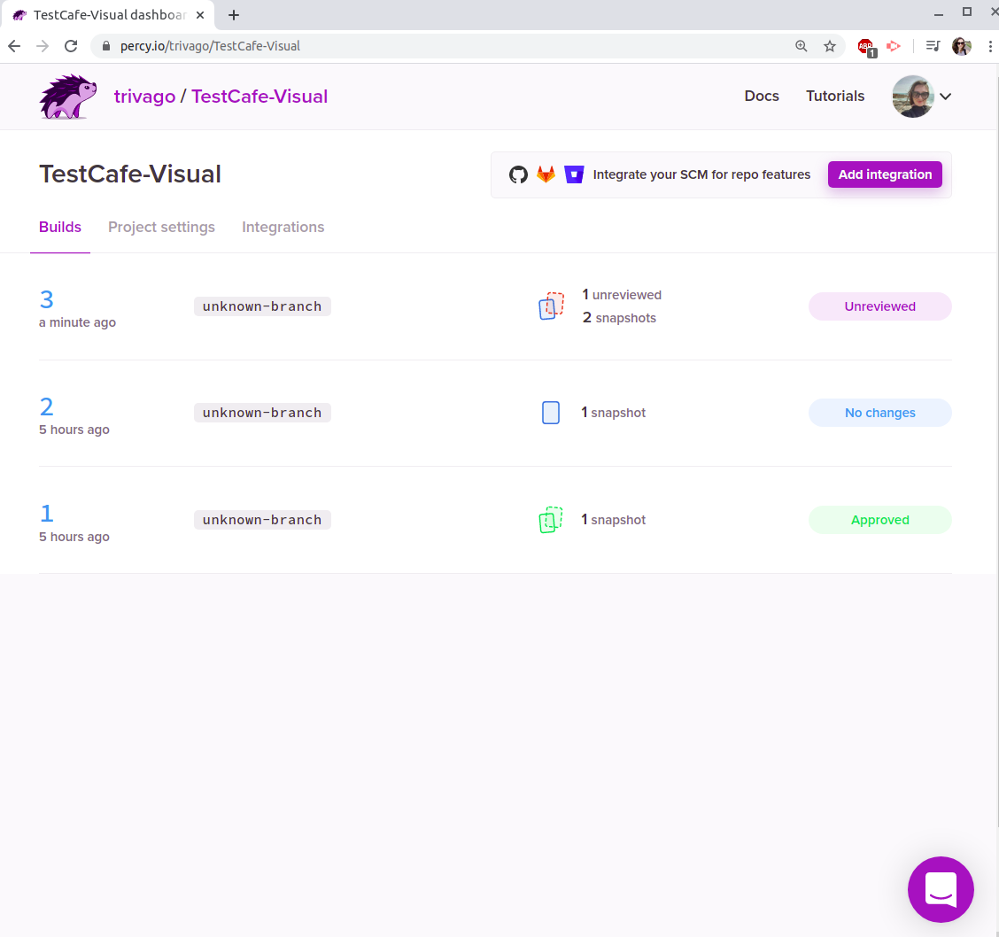

# percy-with-testcafe-example
## Example UI-Snapshot-Testing using [percy.io](https://percy.io/) with [TestCafe](https://devexpress.github.io/testcafe/)
### What:
* These are snapshot UI tests.
* I have created a project at percy.io (https://percy.io/trivago/zerobank).
* The idea is to take snapshots of the UI and every build you compares it.
* The firsts snaposhots need to be approved first.
* The free version of percy allows to play with it and understand it.
* There is testcafe integration as well so it can be used in this project.
### How to use it for your own project:
* Go to https://percy.io and sign up.
* Create a new project in the percy UI, go inside and copy the token mentioned at the botton of the page.
* Initialize your npm-project `$ npm init` and run the the export command you copped at the step 2.
* Install percy: `$ npm install @percy/testcafe`
* Install TestCafe: `$ npm install testcafe`
* Create a scenario like the one in this file. Don't forget to import percySnapshot first.
* At the scripts of your package.json file add this script: "test:percy": `"percy exec -- testcafe chrome ./tests"`
* Run `$ npm run test:percy`
### After every build this is how the UI of percy looks like:

